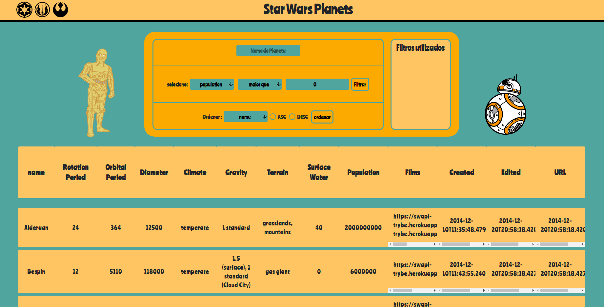

# Welcome! :metal:
## i'm Thalys, let me present a little about myself

---
  >computer enginneer :computer:

  >Fullstack jr developer 

  >Lover of technology, coding, cats :cat:, IOT and Bitcoin

## **Languages**

---
## **Backend**

---

## **Frontend**

---

## **testing tools**
  - react testing library
  - jest
  - mocha

---

## **Projects**

### 1. Star wars planets

### made with:
  > javascript
  
  > react

  > hooks

  
  :heavy_exclamation_mark: this application was made to run on a desktop browser, you can use it in the link below:heavy_exclamation_mark:

  - [star wars planets link](https://star-wars-data-table.vercel.app/)

---

&nbsp;

---

## Learning now about:
  - computer networks [link](https://www.amazon.com.br/Redes-computadores-internet-abordagem-top-down-dp-8581436773/dp/8581436773/ref=dp_ob_image_bk)

---

## Contact 

